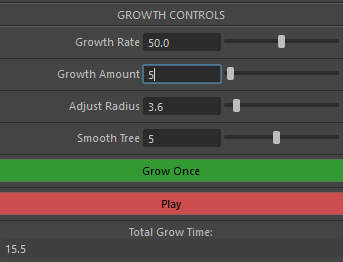
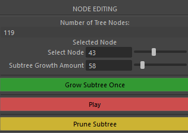
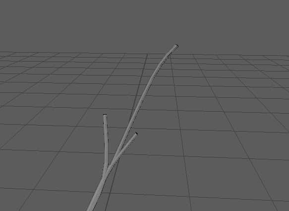
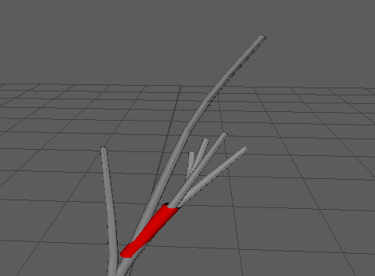
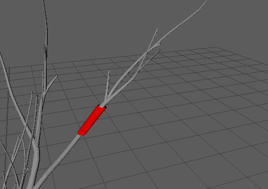
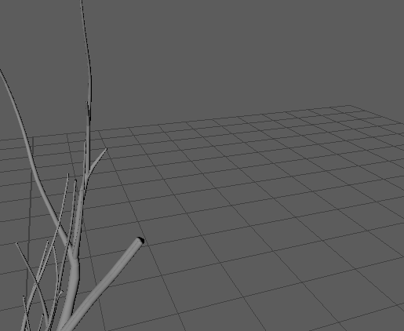
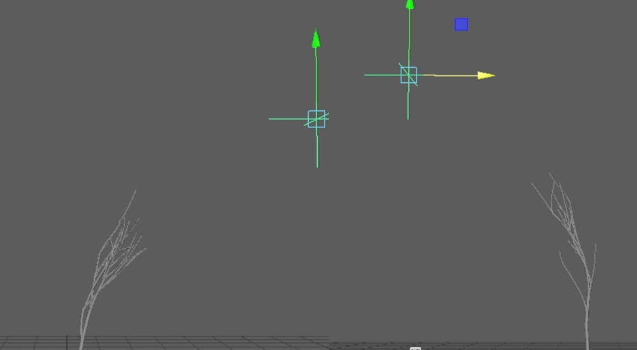
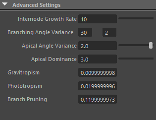

# **TreeVigorate**

Welcome to TreeVigorate, a procedural parameter driven foliage generator with artist control. We've built this Maya plugin tool for seamless integration into technical art pipelines. Simply hook the plugin into Maya, choose your tree genera, and edit your tree as you watch it grow in accelerated real time. For a quick video demo, just click the image above!

## **Contact**

Eli Asimow : easimow@seas.upenn.edu, https://easimow.com 

Avi Serebrenik : seravi@seas.upenn.edu, https://aviserebrenik.wixsite.com/cvsite

## **Built With**

This tool is a direct implementation of the Siggraph paper *Interactive Invigoration: Volumetric Modeling of Trees with Strands* (2024),  Li, B., Schwarz, N. A., Palubicki, W., Pirk, S., and Benes, B. https://dl.acm.org/doi/10.1145/3658206

To achieve this, we utilized a codebase from the researchers’ prior work in [*Rhizomorph: The Coordinated Function of Shoots and Roots*](https://github.com/edisonlee0212/rhizomorph).

## **Installation**

Installation is straight forward. Simply add this .mll to Maya through the Plugin Manager, and either use the tree description files provided, choose a preset, or write a custom one.
[.mll download](https://github.com/Ser-Avi/TreeVigorate/raw/refs/heads/main/TreeVigorate-8-29-2025.mll) [Tree Descriptions](https://download-directory.github.io/?url=https://github.com/Ser-Avi/TreeVigorate/tree/main/TreeDescriptors)

## **Features**

### **Strands**

Strands are a systemized representation of the arbor pathways that carry liquid and nutrients from the trunk of a tree to its tips. First modeled in Matthew Holton’s 1994 paper *Strands, Gravity and Botanical Tree Imagery*, they are the basis for our modeling approach here. The idea is that, by simulating those pathways, we can specifically recreate the growth groove patterns found in many common tree trunks. 

We begin this process by initializing with three strand particles at the end nodes of the tree’s branches. Strand particles are then replicated in planar space at preceding tree nodes, merging into larger collections at each branch intersection point. We use standard distance constraint dynamics to adjust particle positions they are transposed down from their progenitors. By the root of the trunk, all strand particles have coalesced into a singular node’s plane.

*Node Strand Planes, particles represented with vertices*

### **Meshing**

We found our source paper’s delauney based meshing method lacking in edge cases. In the branch merging case, for instance, there was no guarantee of strand particle positional consistency. That is, when a joining left branch and right branch would translate all their corresponding particles into their parent node, their positions would become entangled. This meant that bridging the mesh between these three planes risked triangle intersection. 

*Initial Meshing algorithm with non manifold geometry removed. Not quite right.*

As one of our priorities was a usable, manifold mesh for artists, this problem proved untenable. Instead, we build Bernstein polynomial splines through the thread of each individual strand particle, and mesh them separately as long tubes. This delivers a manifold mesh while still keeping the grooved look of a strand based tree. The only downside is the finalized mesh requires some post-process cleanup. 

*Stress Testing our novel meshing approach. Even with high variance branch twists, intersections resolve without error.*

In the Interactive Invigoration authors’ recent publications, they too have transitioned to a new meshing method, and now use delauney triangulation to solve for meshing across the span of their tree, not just for individual node planes. That’s something we’d love to explore soon, as it seemingly has the best of both our solutions.

### **Artist Control**

It was important that our tool be one of active artist participation, rather than a grow and check system. The average artist will have a specific tree in mind; it’s our tool's job to bend its procedural growth to fit that mold as closely as possible. To achieve this, we empower the artist with explicit control over the procedural growth of the tree. To enable this, we allow users to grow trees for a desired amount, either watching them grow slowly, allowing for edits as they mature, or growing a large, discreet amount, skipping ahead to modifying a fully grown tree.

These same controls are available for our "subtree" modifications seen below:

* **Invigoration** taps directly into the underlying Rhizomorph growth logic, spurring growth from any designated node. Artists can use this like a paint brush, adding length and density where they see fit.

 

* **Pruning** recursively removes all children of a selected branch node. This makes for easy selection and removal of lengthy undesirable paths.

 

* **Sun direction controls** the bias of the tree’s directionality. This can be updated ad hoc, shifting the desired growth path of a tree even mid development.

* **Modifiable Tree parameters**. Starting from a collection of preconfigured tree species, the artist can tune the growth behavior of their tree to achieve drastically different results. 

Together, these features make this a tool that controls how, where, and when the tree grows. 

### **Leaf Instancer Support**

Once they are happy with their tree’s structure, an artist can use the "instance leaves" action to automatically generate a maya instancer node, configured with the calculated positions and rotations of the tree's leaves. For convenience, there is also an export csv option for use in other applications. 

*Tip: consider instancing a group with your leaf mesh as a child object, rather than instancing the leaf mesh itself. This allows for easy repositioning of the leaf pivot point.*

## **Bloopers**

We had a lot go wrong during this project. There are oh so many ways to crash Maya, and oh so many ways for a tree to not look right. Here are some of our highlights from that journey.

